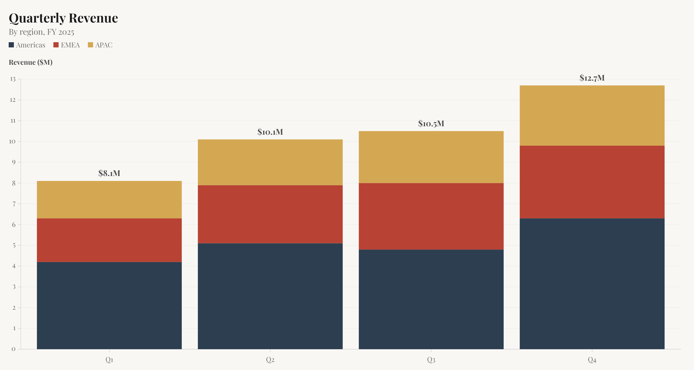
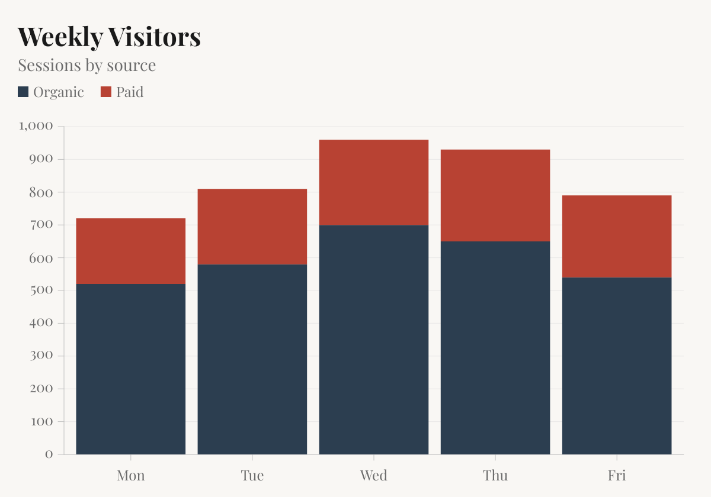
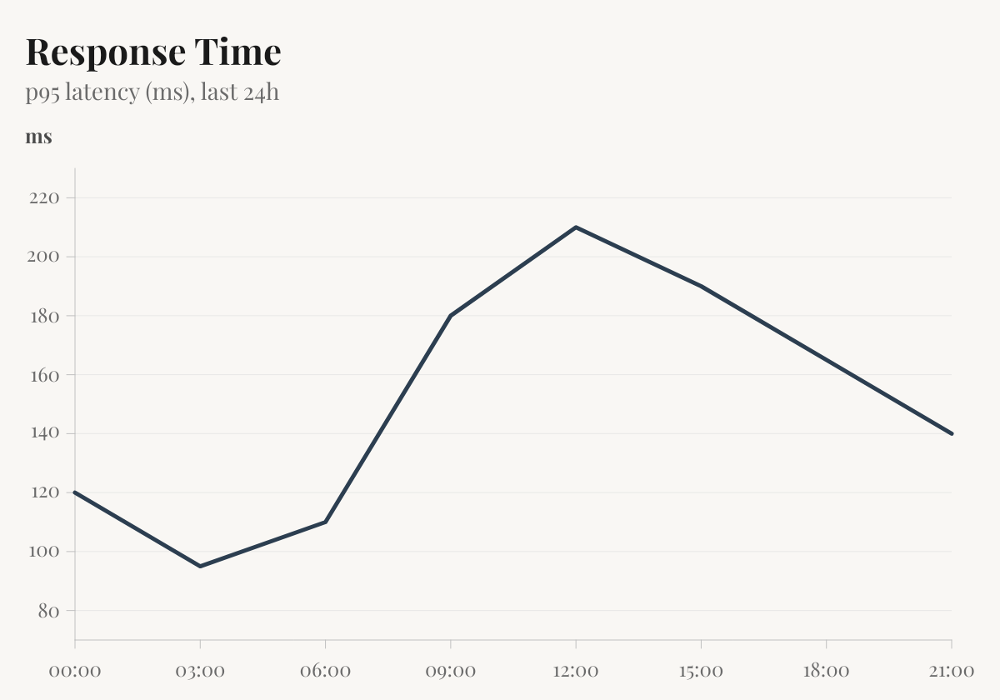

# @szum-io/sdk

Official TypeScript SDK for [szum](https://szum.io), a chart image API.

Turn a JSON config into an SVG or PNG. Embed it in transactional emails, weekly digests, PDF reports, Slack messages, dashboards – anywhere an `` tag works. No headless browser, no canvas, no client-side JavaScript.



## Install

```bash
npm install @szum-io/sdk
```

> **Server-side only.** The SDK sends your API key on every request. Never import it into browser code – generate signed URLs server-side and pass them to the client.

## Quick start

```typescript
import { Szum } from "@szum-io/sdk";

const szum = new Szum({ apiKey: process.env.SZUM_KEY! });

const png = await szum.render({
  format: "png",
  theme: "editorial",
  title: "Quarterly Revenue",
  subtitle: "By region, FY 2025",
  marks: [
    {
      type: "barY",
      data: [
        { x: "Q1", y: 4.2, region: "Americas" },
        { x: "Q2", y: 5.1, region: "Americas" },
        { x: "Q1", y: 2.1, region: "EMEA" },
        { x: "Q2", y: 2.8, region: "EMEA" },
      ],
      fill: "region",
    },
  ],
});
```

## A few marks

| barY                    | line                     | dot                    |
| ----------------------- | ------------------------ | ---------------------- |
|  |  |  |

## Signed URLs

Generate authenticated `` embed URLs (Pro plan):

```typescript
const url = await szum.signedUrl({
  format: "svg",
  theme: "editorial",
  marks: [
    {
      type: "barY",
      data: [
        { x: "Q1", y: 42 },
        { x: "Q2", y: 58 },
      ],
    },
  ],
});

// Use in HTML: 
```

## Configuration

```typescript
const szum = new Szum({
  apiKey: process.env.SZUM_KEY!,
  timeout: 30_000, // ms, default 30s
  maxRetries: 2, // default 2; retries 429, 502, 503, 504, and network errors
});
```

Every method accepts an optional second argument for per-call overrides:

```typescript
const controller = new AbortController();

await szum.render(config, {
  timeout: 60_000, // override client timeout
  signal: controller.signal, // caller-initiated cancellation
});
```

Set `SZUM_DEBUG=true` in your environment to log every request, response status, timing, and retry attempt to stderr.

## Error handling

Errors are typed by category. Match by subclass instead of status codes:

```typescript
import {
  Szum,
  SzumError,
  SzumAuthenticationError,
  SzumRateLimitError,
  SzumInvalidRequestError,
  SzumConnectionError,
} from "@szum-io/sdk";

try {
  await szum.render(config);
} catch (err) {
  if (err instanceof SzumAuthenticationError) {
    // 401 – bad or missing API key
  } else if (err instanceof SzumRateLimitError) {
    // 429 – wait err.retryAfter seconds
  } else if (err instanceof SzumInvalidRequestError) {
    // 400 / 413 – bad config
  } else if (err instanceof SzumConnectionError) {
    // timeout or network error
  } else if (err instanceof SzumError) {
    console.error(err.code); // "api_error", "invalid_request", etc.
    console.error(err.message);
    console.error(err.status); // HTTP status
    console.error(err.retryAfter); // seconds (on 429)
    console.error(err.requestId); // from x-vercel-id – include in support tickets
  }
}
```

All errors serialize cleanly via `JSON.stringify(err)` (they implement `toJSON`), so they work with Sentry, Datadog, and standard loggers.

## Exports

| Export                    | Description                                                         |
| ------------------------- | ------------------------------------------------------------------- |
| `Szum`                    | Client class (`render`, `signedUrl`)                                |
| `SzumOptions`             | Constructor options (`apiKey`, `timeout`, `maxRetries`, …)          |
| `RequestOptions`          | Per-call options (`timeout`, `signal`)                              |
| `SzumError`               | Base error (`code`, `status`, `message`, `retryAfter`, `requestId`) |
| `SzumAuthenticationError` | 401                                                                 |
| `SzumPermissionError`     | 403                                                                 |
| `SzumInvalidRequestError` | 400 / 413                                                           |
| `SzumRateLimitError`      | 429                                                                 |
| `SzumAPIError`            | 5xx                                                                 |
| `SzumConnectionError`     | Timeout / network                                                   |
| `ChartConfig`             | Config type for SDK methods (`version` optional)                    |
| `ChartConfigInput`        | Full config type including required `version`                       |
| `SCHEMA_VERSION`          | Schema version this SDK was built against                           |

## Documentation

Full reference at [szum.io/docs](https://szum.io/docs).
