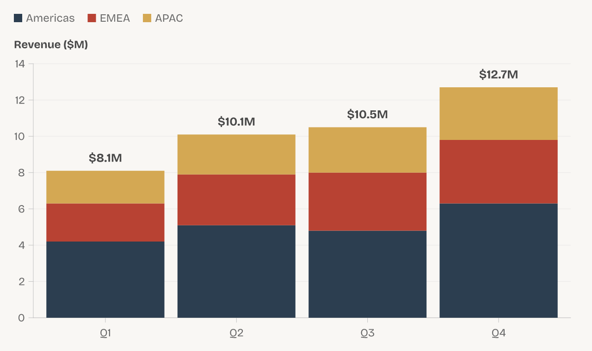

# @szum-io/sdk

Official TypeScript SDK for [Szum](https://szum.io), a chart image API.

Turn a JSON config into an SVG, PNG or interactive embed. Use it in transactional emails, weekly digests, PDF reports, Slack messages, dashboards – anywhere an `` tag works. No headless browser, no canvas, no client-side JavaScript.



## Install

```bash
npm install @szum-io/sdk
```

> **Server-side only.** The authenticated `Szum` client sends your API key on every request. Never import it into browser code – save charts server-side and pass the URLs to the client. The standalone `validateChart` function is anonymous, but the package is distributed for server use.

## Quick start

```typescript
import { Szum } from "@szum-io/sdk";

const szum = new Szum({ apiKey: process.env.SZUM_KEY! });

const png = await szum.render({
  format: "png",
  theme: "editorial",
  title: "Quarterly Revenue",
  subtitle: "By region, FY 2025",
  marks: [
    {
      type: "barY",
      data: [
        { x: "Q1", y: 4.2, region: "Americas" },
        { x: "Q2", y: 5.1, region: "Americas" },
        { x: "Q1", y: 2.1, region: "EMEA" },
        { x: "Q2", y: 2.8, region: "EMEA" },
      ],
      fill: "region",
    },
  ],
});
```

Use `renderWithMetadata` when you also need usage and font-fallback information:

```typescript
const { data, contentType, fontFallback, usage } =
  await szum.renderWithMetadata(config);
```

`render` keeps its original `Promise<Uint8Array>` return type. `renderWithMetadata` returns the same bytes as `data`, plus `contentType`, `fontFallback`, and `{ used, limit, remaining, overage }` from the render response.

## Validate a config

Validation is anonymous, free, and side-effect-free:

```typescript
import { validateChart } from "@szum-io/sdk";

const result = await validateChart(config);

if (!result.valid) {
  console.error(result.errors);
}

if (result.suggestedConfig) {
  // Replace the complete config, then validate it again.
}
```

The result includes the complete `errors` and `diagnostics` arrays. Warnings and suggestions can appear on a valid config.

## Saved charts

Save a config server-side and embed the returned short URL in an `` tag, or drop the embed URL into an `<iframe>` for an interactive version:

```typescript
const chart = await szum.charts.create(
  {
    format: "svg",
    theme: "editorial",
    marks: [
      {
        type: "barY",
        data: [
          { x: "Q1", y: 42 },
          { x: "Q2", y: 58 },
        ],
      },
    ],
  },
  { title: "Quarterly revenue" },
);

// Static image: 
// Interactive embed: <iframe src={chart.embedUrl} />
// Revoke later: await szum.charts.delete(chart.id);
```

`create` returns a **chart object** – `{ id, source, title, createdAt, updatedAt, sizeBytes, publishedAt, imageUrl, embedUrl, configUrl }` – and the same shape comes back from `get`, `update`, `rename`, and each item of `list`. `imageUrl` (`https://szum.io/c/<id>`) renders the same image on every fetch; append `.png`/`.svg` to force a format. `embedUrl` (`https://szum.io/e/<id>`) serves an interactive HTML page with tooltips, legend toggle, and responsive resize. `publishedAt` is an ISO-8601 timestamp, or `null` when the chart's public URLs are dark (an API-created chart is published on create, so it's set).

### Managing saved charts

Beyond `create` and `delete`, the `charts` resource lets you enumerate and edit:

```typescript
// List your charts, newest first; page via nextCursor
const { items, nextCursor } = await szum.charts.list({ source: "api" });

// Sort and search; `total` is the exact match count (present only with `q`)
const { items: hits, total } = await szum.charts.list({
  sort: "title", // "created" (default), "updated", or "title"
  q: "revenue", // case-insensitive title substring
});

// Read one chart's metadata, published config, or complete owner document
const chart = await szum.charts.get(id);
const config = await szum.charts.getConfig(id);
const { config, draft, publishedAt, title } = await szum.charts.getDocument(id);

// Read many configs in one request (max 100 ids)
const { configs, missing } = await szum.charts.getConfigs([id1, id2]);

// Replace a config in place – same id, same /c/ and /e/ URLs
await szum.charts.update(id, {
  format: "svg",
  marks: [
    /* … */
  ],
});

// Rename – metadata only, no config rewrite, same URLs
await szum.charts.rename(id, "Q3 revenue by region");
```

`list` pages via `nextCursor` (pass it back as `cursor`; `null` on the last page). The `cursor` is keyset-coupled to the active `sort`, so keep `sort` stable while paging one result set. Each item also carries `hasDraft` (the chart has unpublished edits). `getConfig` returns only the stored published config and throws when a draft-only chart has none; use `getDocument` when you need both publication and draft state. `getConfigs` returns `{ configs, missing }`; each `missing` entry carries a `reason` – an open set (today `"not_found"` or `"unavailable"`), so match the values you handle and treat anything unfamiliar as a non-fatal skip. `"unavailable"` can mean a transient storage problem or unreadable stored data, so a retry is not guaranteed to help.

## Configuration

```typescript
const szum = new Szum({
  apiKey: process.env.SZUM_KEY!,
  timeout: 30_000, // ms, default 30s
  maxRetries: 2, // default 2
});
```

Every method accepts an optional second argument for per-call overrides:

```typescript
const controller = new AbortController();

await szum.render(config, {
  timeout: 60_000, // override client timeout
  signal: controller.signal, // caller-initiated cancellation
});
```

Set `SZUM_DEBUG=true` in your environment to log every request, response status, timing, and retry attempt to stderr.

Safe requests retry `429`, `502`, `503`, `504`, network failures, and a retryable create `409`, honoring `Retry-After`. Metered render requests retry `429` only: a timeout, network failure, or gateway error can happen after a render was committed, so the SDK does not automatically issue a second potentially billable render.

## Error handling

Errors are typed by category. Match by subclass instead of status codes:

```typescript
import {
  Szum,
  SzumError,
  SzumAuthenticationError,
  SzumRateLimitError,
  SzumInvalidRequestError,
  SzumConnectionError,
} from "@szum-io/sdk";

try {
  await szum.render(config);
} catch (err) {
  if (err instanceof SzumAuthenticationError) {
    // 401 – bad or missing API key
  } else if (err instanceof SzumRateLimitError) {
    // 429 – wait err.retryAfter seconds
  } else if (err instanceof SzumInvalidRequestError) {
    // 400 / 413 – bad config
  } else if (err instanceof SzumConnectionError) {
    // timeout or network error
  } else if (err instanceof SzumError) {
    console.error(err.code); // "api_error", "invalid_request", etc.
    console.error(err.message);
    console.error(err.status); // HTTP status
    console.error(err.retryAfter); // seconds (on 429)
    console.error(err.requestId); // from x-vercel-id – include in support tickets
    console.error(err.issues); // structured chart diagnostics, when present
  }
}
```

All errors serialize cleanly via `JSON.stringify(err)` (they implement `toJSON`), so they work with Sentry, Datadog, and standard loggers.

## Exports

| Export                    | Description                                                                          |
| ------------------------- | ------------------------------------------------------------------------------------ |
| `Szum`                    | Authenticated client (`render`, `renderWithMetadata`, and the `charts` resource)     |
| `validateChart`           | Anonymous, side-effect-free chart validation                                         |
| `SzumOptions`             | Constructor options (`apiKey`, `timeout`, `maxRetries`, …)                           |
| `ValidationOptions`       | Validation transport options (`baseUrl`, `timeout`, `maxRetries`, `signal`)          |
| `RequestOptions`          | Per-call options (`timeout`, `signal`)                                               |
| `RenderResult`            | Bytes plus content type, font fallback, and usage metadata                           |
| `RenderMetadata`          | Generated content-type, font-fallback, and usage metadata contract                   |
| `RenderUsage`             | Render meter (`used`, `limit`, `remaining`, `overage`)                               |
| `SzumError`               | Base error (`code`, `status`, `message`, `retryAfter`, `requestId`, `issues`)        |
| `SzumAuthenticationError` | 401                                                                                  |
| `SzumPermissionError`     | 403                                                                                  |
| `SzumInvalidRequestError` | 400 / 413                                                                            |
| `SzumRateLimitError`      | 429                                                                                  |
| `SzumAPIError`            | 5xx                                                                                  |
| `SzumConnectionError`     | Timeout / network                                                                    |
| `ChartConfig`             | Config type for SDK methods (`version` optional)                                     |
| `ChartConfigInput`        | Full config type including required `version`                                        |
| `ChartDiagnostic`         | One structured validation or request diagnostic                                      |
| `ChartValidationResult`   | Result returned by `validateChart`                                                   |
| `SavedChart`              | Saved-chart object from `charts.create`/`get`/`update`/`rename`/`list`               |
| `SavedChartCreateOptions` | `charts.create` transport options plus optional `title`                              |
| `SavedChartDocument`      | Owner document from `charts.getDocument` (`config`, `draft`, `publishedAt`, `title`) |
| `SavedChartListItem`      | A `charts.list` item: `SavedChart` plus a listing-only `hasDraft` flag               |
| `SavedChartListParams`    | Filters and pagination options accepted by `charts.list`                             |
| `SavedChartSource`        | Open union of chart origins (`"api"`, `"figma"`, `"app"`, `"mcp"`, …)                |
| `SavedChartSort`          | `charts.list` sort order (`"created"`, `"updated"`, `"title"`)                       |
| `SavedChartPage`          | `charts.list` result (`items`, `nextCursor`, optional `total`)                       |
| `SavedChartConfigs`       | `charts.getConfigs` result (`configs`, `missing`)                                    |
| `ConfigMissingReason`     | Open union: why a config was missing (`"not_found"`, `"unavailable"`, …)             |
| `SCHEMA_VERSION`          | Schema version this SDK was built against                                            |

## Documentation

Full reference at [szum.io/docs](https://szum.io/docs).
